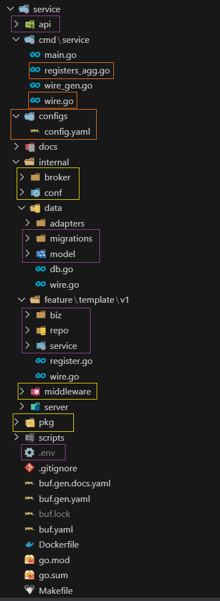

# 🚀 Kratos Template Project (PowerShell + Make)

Este repositorio es un **template** para proyectos basados en [Go Kratos](https://go-kratos.dev/), con soporte para:

- Generación de código con **buf**  
- Inyección de dependencias con **wire**
- Flujo de trabajo completo de **módulos** (proto, feature, repo, biz, service)  
- **Documentación OpenAPI** autogenerada
  - [Swagger](https://swagger.io/)
  - [Scalar](https://scalar.com/)
- Scripts **PowerShell** para Windows, integrados en `make`
- Soporte de dos tipos de base de datos.
  - **MySQL** (GORM)
    - Ensure - Comprobar si existe un esquema y autogeneración utilizando scripts `.sql`
    - Migrate - Migraciones de tablas y configuración de campos.
    - Seed - Autogeneración de valores por defecto utilizando scripts `.sql`
  - **Postgres** (GORM)
    - Ensure - Comprobar si existe un esquema y autogeneración utilizando scripts `.sql`
    - Migrate - Migraciones de tablas y configuración de campos.
    - Seed - Autogeneración de valores por defecto utilizando scripts `.sql`

---

## 📦 Requisitos

- [Go](https://go.dev/) ≥ 1.25 
- [buf](https://buf.build) con extención recomendada `Buf`
  - En caso de utilizar [Cursor](https://cursor.com/dashboard) hay que instalar la extención utilizando [VSIX](https://www.vsixhub.com/vsix/155966/) 
- [Protocol Buffers](https://protobuf.dev/) - Compilador de protobuf (`protoc`)
  - Windows: `choco install protoc`
- [wire](https://github.com/google/wire)
- PowerShell (Windows o [pwsh cross-platform](https://learn.microsoft.com/en-us/powershell/))  

---

## ⚡ Configuraciines `.env`

```sh
# Database (Puede ser MySQL o Postgres)
DB_DRIVER= mysql # mysql | postgres
DB_USER=root
DB_PASSWORD=passw@rd
DB_HOST=127.0.0.1
DB_PORT=3307
DB_SCHEMA=kratos-template # Nombre de la esquema

# Configuraciones adicionales para Postgres
# DB_SSLMODE=disable # disable|require|verify-ca|verify-full
# DB_TS=UTC # Europe/Madrid

# MQTT Broker
MQTT_USERNAME="usernamemqtt"                
MQTT_PASSWORD="passw@rdmqtt"
```
---

## ⚡ Flujo recomendado

Lo mejor para ejecutar el servicio por primera vez es usar `make all`.

Comando `make all` ejecuta otros `make` en orden correcto.

```sh
make all        # init -> gen -> wire -> run
# Orden de make
make init       # instala herramientas necesarias
make gen        # genera código protobuf (buf generate)
make wire       # genera inyección con wire
make run        # ejecuta con kratos run (hot reload)
```

## 📚 Flujo recomendado módulos

Al iniciar el proyecto y asegurarnos de que todas las configuraciones sean correctas, podemos crear y eliminar módulos automáticamente en nuestro proyecto.

> ⓘ **Nota:** Es importante saber que, en caso de **no usar base de datos**, será necesario **comentar `data.ProviderSet`** dentro de **`cmd/service/wire.go`** para evitar **errores de wire**.

Crear un módulo completo (proto + feature + repo + biz + service + wire + generación .proto y docs):

```sh
make module name="foo"
```

Eliminar un módulo:

```sh
make module-delete name="foo"               # todas las versiones
make module-delete name="foo" version="v2"  # sólo v2
```

## 📝 Commit + versionado automático

Cuando trabajamos con proyectos, debemos tener un repositorio del proyecto en **GitHub**.

Por lo tanto, tendremos una **rama principal (main o master)** y **ramas adicionales** donde trabajaremos y desde las cuales enviaremos pull requests para integrar los cambios en la rama principal, y luego para **`CI/CD`**.

<details>
<summary>👉 Click para ver GIF</summary>


</details>

Para ello, debemos crear una rama y después **hacer commits** usando `make`.

En caso de intentar hacer commit directamente en la rama main/master utilizando `make`, se producirá un error.

```sh
make commit t="Titulo" d="Descripcion"
```

El proyecto tiene `config.yaml` donde nosotros podemos introducir la `versión del proyecto`. La **versión es importante** para poder realizar los commits. Por ejemplo, si tenemos la versión v3 de nuestra aplicación, esto significa que los commits se generarán con etiquetas de versión **v3.X, donde X es el número del commit en el repositorio**.

## 📑 Documentación OpenAPI

- Los `.proto` generan automáticamente documentación en `docs/` y `docs/openapi/`.
- Archivos como `openapi_embed.go` no se eliminan al regenerar docs.

```sh
make docs
```

## 🛠️ Compilar binario (Build project)

Podemos compilar el archivo binario usando `make build`, lo que creará la carpeta **bin**.
Dentro de ella se generará una subcarpeta con la fecha y hora actuales, y en esa carpeta estarán:

- El archivo binario para **Linux**.
- El archivo **config.yaml** copiado del proyecto.
- El archivo **.env** copiado del proyecto.

```sh
make build     # Compilar binario en bin/
```

#### 🔧 Comandos principales 

```sh
make help      # Ayuda interactiva (colores y ejemplos)
make init      # Instalar/actualizar herramientas + go mod tidy
make deps      # Actualizar buf.lock si cambió buf.yaml
make gen       # Generar código protobuf (usa buf.gen.yaml)
make wire      # Generar inyección (wire) en cmd/service
make build     # Compilar binario en bin/
make run       # Ejecutar con kratos run
make gorun     # Ejecutar con go run directamente
make clean     # Limpiar binarios, wire_gen.go, archivos .pb.go
make docs      # Regenerar documentación (docs/ y docs/openapi)
```
#### 🔧 Comandos de módulos

```sh
make module-proto name="foo"    # Generar sólo .proto
make module-feature name="foo"  # Generar sólo feature
make module-repo name="foo"     # Generar sólo repo
make module-biz name="foo"      # Generar sólo biz
make module-service name="foo"  # Generar sólo service
make module-wire name="foo"     # Generar sólo wire
```

## 📑 Archivo `./configs/config.yaml`

<details>
<summary>👉 Click para ver el contenido config.yaml</summary>

```yaml
app:
  mode: dev # modo dev / pro
  name: kratos-template
  version: v1

server:
  http:
    addr: 0.0.0.0:8000
    timeout: 1s
  grpc:
    addr: 0.0.0.0:9000
    timeout: 1s
data:
  database:
    ensure_schema: false
    migrations: false
    seed: false
# redis:
#   addr: 127.0.0.1:6379
#   read_timeout: 0.2s
#   write_timeout: 0.2s
  mqtt:
    active: false # true or false (true = if you can connect to the broker, false = inactive (no connection))
    source: "tcp://10.70.20.40:1883"
    client_id: "client_kratos_template"
    max_reconnect_interval: "60s"
    topics:
      - "receiver/ltm/#"
      - "receiver/lta/#"
      - "receiver/ltc/#"
      - "receiver/scr/#"
```

</details>

#### 🟢 Bloque `app`

El archivo de configuración tiene un bloque app en el que debemos indicar el tipo: dev o pro.
Si especificamos dev, entonces en nuestro proyecto los logs mostrarán salidas con la marca `DEBUG`.

Después sigue el nombre de la aplicación y también la versión.

#### 🟢 Bloque `server`

Dentro del bloque server podemos configurar el puerto del servidor y el tiempo de espera (timeout).
También es posible cambiar la IP, pero se recomienda dejarla como 0.0.0.0 para evitar problemas inesperados de accesibilidad.

#### 🟢 Bloque `data`

Dentro del bloque de **base de datos** podemos configurar:
- **automigraciones**
- **ensure** (asegurar la creación de la base o el esquema)
- **seed** (cargar datos iniciales).

> ⓘ **Nota:** Actualmente, la estructura solo soporta una base de datos, aunque en el futuro se implementará una nueva versión que permitirá soportar varios esquemas al mismo tiempo.

##### 🟢 Bloque `redis` y `mqtt` dentro del bloque `data`

Después vienen dos bloques: `redis` y `mqtt`, que se encuentran dentro del bloque `data`.

- `redis` está comentado porque, de momento, no lo utilizamos.
- `mqtt` contiene la configuración de conexión y los tópicos a los que queremos suscribirnos. 
También existe la opción de **desactivar mqtt**, lo que significa que la configuración seguirá presente, pero el servicio no intentará conectarse.

## 📑 La estructura del proyecto

<details>
<summary>👉 Click para ver pequeña mapa de la estructura</summary>



</details>